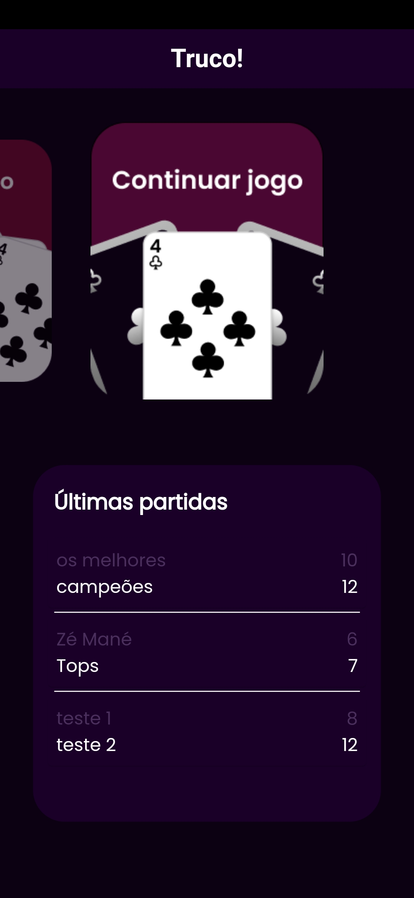

<h1> TRUCO!</h1>

<h2> Ei, você ai que joga truco e não tem como marcar sua pontuação no jogo, tenho uma solução para você!</h2>

<h2>Apresento-lhes o mais novo app de placar de truco, o TRUCO!<h2>

<h2> Sim! agora você pode marcar seus pontos da melhor forma possível, com uma interface pensada para melhorar a experiencia dos usuários.</h2>

  
  
  
  
  
  
  
  
  

  <h2>Principais funcionalidades:</h2>
<ul>
  <li>Botão de truco para adicionar +3 pontos ao placar</li>
  <li>Histórico de partidas</li>
  <li>Botão para continuar partida anterior</li>
  <li>Indicação de ganhador da partida (tanto no histórico quanto durante a partida)</li>
  <li>Opções de personalização de cores dos placares</li>
</ul>

## Logo mais estarei disponibilizando o link para download na Play Store, fiquem ligados! 

Este projeto está sendo desenvolvido em Flutter com o intuito de aprender/melhorar meu conhecimento em desenvolvimento mobile

